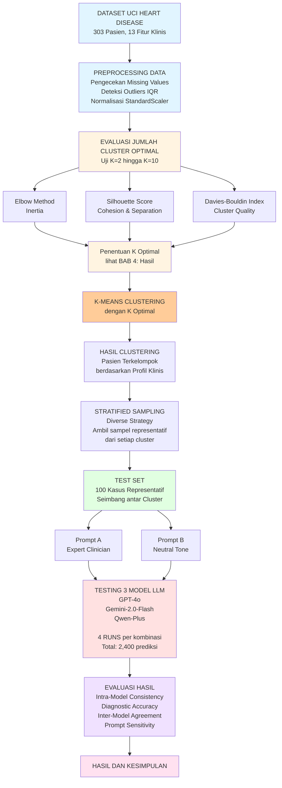

# BAB 3 - METODOLOGI PENELITIAN

---

## 3.1 Desain Penelitian

Penelitian ini menggunakan desain eksperimental dengan pendekatan evaluasi kuantitatif untuk menilai konsistensi dan akurasi Large Language Models (LLM) dalam diagnosis medis biner. Penelitian ini dirancang untuk menjawab pertanyaan penelitian mendasar: **apakah model LLM dapat memberikan prediksi diagnosis yang konsisten dan akurat pada kasus medis yang sama ketika dijalankan berulang kali?**

### 3.1.1 Jenis Penelitian

Penelitian ini merupakan **penelitian eksperimental kuantitatif** dengan karakteristik sebagai berikut (Rajpurkar et al., 2022; Zhang et al., 2022):

1. **Eksperimental**: Penelitian ini melakukan pengujian sistematis terhadap tiga model LLM (GPT-4o, Gemini-2.0-Flash, dan Qwen-Plus) dengan mengontrol variabel-variabel tertentu (prompt, parameter model, data input) untuk mengamati pengaruhnya terhadap konsistensi dan akurasi prediksi (Thirunavukarasu et al., 2023).

2. **Kuantitatif**: Semua hasil diukur menggunakan metrik numerik yang terstandarisasi, termasuk skor konsistensi (0-1), akurasi diagnostik (0-100%), dan berbagai metrik evaluasi lainnya seperti precision, recall, dan F1-score (Rajkomar et al., 2019).

3. **Multi-run Protocol**: Berbeda dengan penelitian evaluasi LLM konvensional yang hanya menjalankan satu kali prediksi per kasus, penelitian ini mengimplementasikan **protokol multi-run** di mana setiap model dijalankan **4 kali** untuk setiap kasus medis (Elazar et al., 2024; Lee et al., 2024). Pendekatan ini memungkinkan pengukuran konsistensi intra-model (reproducibility) yang belum banyak dieksplorasi dalam literatur sebelumnya (Zhang et al., 2023; Meskó & Topol, 2023).

### 3.1.2 Kerangka Konseptual Penelitian

Penelitian ini didasarkan pada kerangka konseptual yang membedakan antara dua dimensi kualitas sistem AI medis (Ghassemi et al., 2020; Chen et al., 2021):

**Konsistensi (Consistency)**: Kemampuan model untuk memberikan prediksi yang sama ketika diberikan input yang identik pada waktu yang berbeda. Konsistensi tinggi menunjukkan reproducibility dan reliability sistem (Elazar et al., 2024).

**Akurasi (Accuracy)**: Kemampuan model untuk memberikan prediksi yang sesuai dengan ground truth diagnosis. Akurasi tinggi menunjukkan validitas klinis sistem (Rajkomar et al., 2019).

Hipotesis penelitian ini adalah bahwa kedua dimensi ini **tidak selalu berkorelasi positif** (Zhang et al., 2023). Sebuah model dapat sangat konsisten (selalu memberikan jawaban yang sama) namun tidak akurat (selalu salah), atau sebaliknya (Obermeyer et al., 2019; Vyas et al., 2020). Pemahaman tentang hubungan antara konsistensi dan akurasi ini krusial untuk deployment LLM dalam setting klinis (Meskó & Topol, 2023).

### 3.1.3 Alur Penelitian

Penelitian ini dilaksanakan dalam 6 tahap utama yang saling berkaitan:

**tahap 1: Persiapan Data**
- Pengambilan dataset UCI Heart Disease (303 pasien)
- Preprocessing: pengecekan missing values dan outliers
- Normalisasi data menggunakan StandardScaler

**tahap 2: Clustering**
- Implementasi K-Means clustering
- Evaluasi jumlah cluster optimal (K=2 hingga K=10)
- Analisis karakteristik setiap cluster

**tahap 3: Stratified Sampling**
- Pengambilan sampel representatif dari setiap cluster
- Implementasi strategi "diverse" sampling
- Pembuatan test set 100 kasus

**tahap 4: Desain Prompt**
- Pengembangan dua variasi prompt (Expert vs Neutral)
- Validasi struktur dan format prompt
- Persiapan template untuk input data klinis

**tahap 5: Testing LLM Multi-Run**
- Testing 3 model LLM (GPT-4o, Gemini-2.0-Flash, Qwen-Plus)
- 4 runs per kasus untuk setiap kombinasi (model — prompt)
- Total 2,400 prediksi (100 kasus — 4 runs — 3 models — 2 prompts)
- Implementasi Checkpoint system untuk reliability

**tahap 6: Evaluasi dan Analisis**
- perhitungan metrik konsistensi (intra-model consistency)
- perhitungan metrik akurasi (accuracy, precision, recall, F1)
- Analisis inter-model agreement
- Analisis prompt sensitivity
- Interpretasi hasil dan penarikan kesimpulan

### 3.1.4 Diagram Alur Penelitian


---

## 3.2 Data dan Sumber Data

### 3.2.1 Dataset UCI Heart Disease

Penelitian ini menggunakan **UCI Heart Disease Dataset** (Goldberger et al., 2000) yang merupakan salah satu dataset medis paling terkenal dan banyak digunakan dalam penelitian machine learning untuk diagnosis kardiovaskular (Mohan et al., 2019; Ali et al., 2021). Dataset ini dipilih karena beberapa alasan:

1. **Validitas Klinis**: Data dikumpulkan dari institusi medis terkemuka (Cleveland Clinic Foundation, Hungarian Institute of Cardiology, V.A. Medical Center Long Beach, dan University Hospital Zurich) yang memastikan kualitas dan reliabilitas data klinis (Alkhodari et al., 2023).

2. **Standarisasi**: Dataset telah melalui proses cleaning dan validasi oleh komunitas penelitian internasional (Mohan et al., 2019).

3. **Representatif**: Mencakup 13 parameter klinis yang umum digunakan dalam diagnosis penyakit jantung di praktik medis nyata (Sapra & Sapra, 2024).

4. **Aksesibilitas**: Tersedia secara publik dan bebas digunakan untuk penelitian akademis (Goldberger et al., 2000).

#### Karakteristik Dataset

Dataset UCI Heart Disease memiliki karakteristik sebagai berikut:

- **Sumber**: UCI machine Learning Repository (Dua, D. dan Graff, C., 2019)
- **jumlah Sampel**: 303 pasien
- **jumlah Fitur**: 13 parameter klinis (variabel independen)
- **Target Variable**: 1 variabel biner (0 = tidak sakit jantung, 1 = sakit jantung)
- **Distribusi Kelas**:
  * Kelas 0 (sehat): 138 pasien (45.5%)
  * Kelas 1 (Sakit): 165 pasien (54.5%)
- **Missing Values**: Dataset tidak mengandung missing values
- **Tipe Data**: Campuran numerik (continuous dan categorical)

#### Parameter Klinis (13 Fitur)

Berikut adalah deskripsi lengkap dari 13 parameter klinis yang digunakan dalam penelitian ini:

| No | Parameter | Tipe | Range | Deskripsi | Interpretasi Klinis |
|----|-----------|------|-------|-----------|---------------------|
| 1 | **age** | Numerik | 29-77 tahun | Usia pasien dalam tahun | Usia lanjut merupakan faktor risiko penyakit jantung |
| 2 | **sex** | Kategorikal | 0, 1 | Jenis kelamin pasien | 0 = Perempuan, 1 = Laki-laki. Laki-laki memiliki risiko lebih tinggi |
| 3 | **cp** | Kategorikal | 0-3 | Tipe nyeri dada (Chest pain type) | 0 = Typical angina (angina tipikal), 1 = Atypical angina (angina atipikal), 2 = Non-anginal pain (nyeri non-angina), 3 = Asymptomatic (tanpa gejala) |
| 4 | **trestbps** | Numerik | 94-200 mmHg | Tekanan darah istirahat | Tekanan darah tinggi (>140 mmHg) merupakan indikator risiko kardiovaskular |
| 5 | **chol** | Numerik | 126-564 mg/dl | Kadar kolesterol serum | Kolesterol tinggi (>240 mg/dl) meningkatkan risiko penyakit jantung |
| 6 | **fbs** | Kategorikal | 0, 1 | Gula darah puasa > 120 mg/dl | 0 = Tidak (‰¤120 mg/dl), 1 = Ya (>120 mg/dl). Indikator diabetes |
| 7 | **restecg** | Kategorikal | 0-2 | hasil elektrokardiografi istirahat | 0 = Normal, 1 = ST-T wave abnormality (kelainan gelombang ST-T), 2 = Left ventricular Hypertrophy (Hipertrofi ventrikel kiri) |
| 8 | **thalach** | Numerik | 71-202 bpm | Detak jantung maksimum saat tes olahraga | Detak jantung maksimum yang rendah dapat mengindikasikan masalah jantung |
| 9 | **exang** | Kategorikal | 0, 1 | Angina yang dipicu oleh olahraga | 0 = Tidak ada, 1 = Ada. Indikator kuat penyakit arteri koroner |
| 10 | **oldpeak** | Numerik | 0-6.2 | Depresi ST yang dipicu olahraga relatif terhadap istirahat | Nilai positif menunjukkan iskemia miokard (kurang oksigen ke otot jantung) |
| 11 | **slope** | Kategorikal | 0-2 | Kemiringan segmen ST puncak saat olahraga | 0 = Upsloping (naik), 1 = Flat (datar), 2 = Downsloping (turun). Downsloping = risiko tinggi |
| 12 | **ca** | Kategorikal | 0-4 | jumlah pembuluh darah besar yang terlihat pada fluoroskopi | 0 = Tidak ada penyumbatan, 4 = Penyumbatan maksimal |
| 13 | **thal** | Kategorikal | 0-3 | hasil tes thalassemia | 0 = Normal, 1 = Fixed defect (cacat permanen), 2 = Reversible defect (cacat reversibel), 3 = Lainnya |

#### Relevansi Klinis Parameter

Setiap parameter dalam dataset memiliki relevansi klinis yang telah terbukti dalam literatur medis:

- **Parameter Demografis** (age, sex): Faktor risiko dasar yang tidak dapat dimodifikasi
- **Parameter Kardiovaskular** (trestbps, chol, thalach): Indikator fungsi jantung dan pembuluh darah
- **Parameter Metabolik** (fbs): Indikator risiko diabetes yang berkaitan dengan penyakit jantung
- **Parameter Diagnostik** (cp, restecg, exang, oldpeak, slope): hasil pemeriksaan klinis dan tes diagnostik
- **Parameter Anatomis** (ca, thal): hasil imaging dan tes laboratorium spesifik

### 3.2.2 Preprocessing Data

Sebelum data digunakan untuk clustering dan testing LLM, dilakukan tahapan preprocessing untuk memastikan kualitas dan kesiapan data.

#### Pengecekan Missing Values

Langkah pertama adalah melakukan pengecekan terhadap missing values (nilai yang hilang) dalam dataset. Dataset UCI Heart Disease yang digunakan dalam penelitian ini tidak mengandung missing values, sehingga tidak diperlukan imputasi data.

**Kode Python untuk Pengecekan**:
```python
import pandas as pd

# Load dataset
data = pd.read_csv('data/heart.csv')

# Check for missing values
missing_values = data.isnull().sum()
print("Missing values per column:")
print(missing_values)

# Result: All columns have 0 missing values
```

#### Deteksi Outliers

Pengecekan outliers dilakukan menggunakan **metode IQR (Interquartile Range)** untuk memastikan tidak ada nilai ekstrem yang tidak wajar secara medis.

**Metode IQR**:
$$\text{Lower Bound} = Q_1 - 1.5 \times IQR$$
$$\text{Upper Bound} = Q_3 + 1.5 \times IQR$$

di mana:
- $Q_1$ = Kuartil pertama (25th percentile)
- $Q_3$ = Kuartil ketiga (75th percentile)
- $IQR = Q_3 - Q_1$ (Interquartile Range)

**Kode Python untuk Deteksi Outliers**:
```python
# Detect outliers using IQR method
outlier_counts = {}
for col in numeric_cols:
    Q1 = df[col].quantile(0.25)
    Q3 = df[col].quantile(0.75)
    IQR = Q3 - Q1
    lower_bound = Q1 - 1.5 * IQR
    upper_bound = Q3 + 1.5 * IQR
    outliers = df[(df[col] < lower_bound) | (df[col] > upper_bound)]
    outlier_counts[col] = len(outliers)
```

**Hasil Deteksi**: Beberapa fitur memiliki outliers secara statistik, namun setelah verifikasi semua nilai berada dalam **range medis yang masuk akal** (misalnya, kolesterol tinggi >350 mg/dL memang mungkin secara klinis). Oleh karena itu, **tidak dilakukan removal outliers** karena nilai-nilai tersebut merepresentasikan variasi alami dalam populasi pasien.

#### Normalisasi Data (Standardization)

Normalisasi data dilakukan menggunakan **StandardScaler** dari library scikit-learn (Agarwal et al., 2021). Proses ini penting untuk memastikan semua fitur berada dalam skala yang sama, terutama untuk algoritma clustering K-Means yang sensitif terhadap skala fitur (Shang et al., 2025).

**Persamaan Normalisasi (Z-Score Standardization)**:

$$z = \frac{x - \mu}{\sigma}$$

di mana:
- $z$ = nilai ternormalisasi (standardized value)
- $x$ = nilai asli (original value)
- $\mu$ = mean (rata-rata) dari fitur
- $\sigma$ = standar deviasi dari fitur

**Interpretasi**:
- setelah normalisasi, setiap fitur akan memiliki mean = 0 dan standar deviasi = 1
- Nilai $z = 0$ berarti nilai sama dengan mean
- Nilai $z > 0$ berarti nilai di atas mean
- Nilai $z < 0$ berarti nilai di bawah mean
- Sebagian besar nilai akan berada dalam range -3 hingga +3

**Kegunaan Normalisasi**:

1. **Menghilangkan Bias Skala**: Tanpa normalisasi, fitur dengan skala besar (misalnya cholesterol: 126-564) akan mendominasi perhitungan jarak dalam K-Means dibandingkan fitur dengan skala kecil (misalnya sex: 0-1).

2. **Meningkatkan Konvergensi**: K-Means akan konvergen lebih cepat dan stabil dengan fitur yang ternormalisasi.

3. **Memfasilitasi Interpretasi**: setelah normalisasi, jarak Euclidean antar sampel lebih bermakna karena semua fitur berkontribusi secara seimbang.

**Implementasi Normalisasi**:
```python
from sklearn.preprocessing import StandardScaler

# Separate features and target
X = data.drop('target', axis=1)
y = data['target']

# Initialize StandardScaler
scaler = StandardScaler()

# Fit and transform the features
X_normalized = scaler.fit_transform(X)

# Result: X_normalized Has mean ‰ˆ 0 and std ‰ˆ 1 for all features
```

**ContoH hasil Normalisasi**:

| Fitur | Nilai Asli (Pasien 1) | Nilai Ternormalisasi |
|-------|------------------------|----------------------|
| age | 63 tahun | 0.952 |
| trestbps | 145 mmHg | 0.763 |
| chol | 233 mg/dl | -0.256 |
| thalach | 150 bpm | 0.015 |

#### Verifikasi Kualitas Data

setelah preprocessing, dilakukan verifikasi untuk memastikan data siap digunakan:

1. **Tidak ada missing values**: œ“ Confirmed
2. **Tidak ada outlier ekstrem**: œ“ Checked (semua nilai dalam range medis yang masuk akal)
3. **Distribusi fitur**: œ“ Visualized (Histogram dan boxplot)
4. **Korelasi antar fitur**: œ“ Analyzed (tidak ada multikolinearitas ekstrem)

### 3.2.3 Pembagian Data

Dalam penelitian ini, data **tidak dibagi** menjadi training set dan testing set seperti pada penelitian machine learning konvensional. Alasannya adalah:

1. **Fokus Penelitian**: Penelitian ini tidak melakukan training model baru, melainkan mengevaluasi kemampuan LLM pre-trained yang sudah ada.

2. **Full Dataset untuk Clustering**: Seluruh 303 pasien digunakan untuk proses clustering agar diperoleh representasi yang komprehensif dari variasi dalam dataset.

3. **Stratified Sampling**: Dari hasil clustering, dilakukan stratified sampling untuk memilih 100 kasus yang representatif untuk testing LLM.

Pendekatan ini berbeda dari penelitian machine learning tradisional dan lebih sesuai dengan tujuan penelitian evaluasi LLM.

---

---

## 3.3 Metode Clustering

### 3.3.1 K-Means Clustering

Clustering merupakan tahap penting dalam penelitian ini untuk mengidentifikasi kelompok-kelompok alami dalam data sebelum melakukan stratified sampling (Tsoi et al., 2020). Tujuan utama clustering adalah untuk memastikan bahwa sampel yang dipilih untuk testing LLM **representatif** dan **beragam**, mencakup berbagai karakteristik klinis pasien (Shang et al., 2025).

#### Tujuan dan Prinsip K-Means

**K-Means Clustering** adalah algoritma unsupervised learning yang mempartisi data menjadi K kelompok (clusters) berdasarkan kesamaan fitur (Shang et al., 2025). Prinsip dasar K-Means adalah:

1. **Partisi Data**: Membagi dataset menjadi K kelompok yang saling eksklusif
2. **Kesamaan Intra-Cluster**: Sampel dalam satu cluster memiliki karakteristik yang mirip
3. **Perbedaan Inter-Cluster**: Sampel dari cluster berbeda memiliki karakteristik yang berbeda
4. **Optimasi Jarak**: meminimalkan jarak total antara sampel dengan centroid cluster-nya

#### Algoritma K-Means

Algoritma K-Means bekerja secara iteratif dengan Langkah-Langkah sebagai berikut:

```
INPUT: Dataset X dengan n sampel dan d fitur, jumlah cluster K
OUTPUT: Label cluster untuk setiap sampel, posisi K centroids

1. INISIALISASI:
   - PiliH K centroid awal secara acak dari dataset
   - c_j‚, c_j‚‚, ..., c_j‚– = K centroids initial

2. REPEAT hingga konvergensi:
   
   a. ASSIGNMENT STEP:
      - Untuk setiap sampel x_i dalam dataset:
        * Hitung jarak ke semua K centroids
        * Assign x_i ke cluster dengan centroid terdekat
        * label(x_i) = argmin_j d(x_i, c_j)
   
   b. UPDATE STEP:
      - Untuk setiap cluster j:
        * Hitung centroid baru = rata-rata semua sampel di cluster j
        * c_j = (1/|C_j|) Σ_{x∈C_j} x
        * di mana C_j = Himpunan sampel di cluster j
   
   c. CheCK CONVERGENCE:
      - Jika posisi centroids tidak berubah: STOP
      - Jika perubahan < Threshold epsilon: STOP
      - Jika iterasi maksimum tercapai: STOP
      - Else: CONTINUE to step 2a

3. RETURN:
   - Label cluster untuk setiap sampel
   - Posisi final K centroids
```

#### Persamaan Matematika K-Means

**1. Jarak Euclidean**

Jarak antara sampel $x$ dan centroid $c$ dihitung menggunakan jarak Euclidean (Shang et al., 2025):

$$d(x, c) = \sqrt{\sum_{i=1}^{n} (x_i - c_i)^2}$$

di mana:
- $d(x, c)$ = jarak Euclidean antara sampel $x$ dan centroid $c$
- $n$ = jumlah fitur (13 fitur dalam penelitian ini)
- $x_i$ = nilai fitur ke-$i$ dari sampel $x$
- $c_i$ = nilai fitur ke-$i$ dari centroid $c$

**Interpretasi**: Jarak Euclidean mengukur "perbedaan" keseluruhan antara profil klinis pasien dengan karakteristik tipikal cluster. Semakin kecil jarak, semakin mirip pasien dengan cluster tersebut.

**2. Fungsi Objektif (Inertia / Within-Cluster Sum of Squares)**

K-Means berusaha meminimalkan fungsi objektif yang disebut **Inertia**:

$$J = \sum_{j=1}^{K} \sum_{x \in C_j} \|x - \mu_j\|^2$$

di mana:
- $J$ = inertia (Within-Cluster Sum of Squares / WCSS)
- $K$ = jumlah cluster
- $C_j$ = Himpunan sampel yang termasuk cluster ke-$j$
- $\mu_j$ = centroid cluster ke-$j$
- $\|x - \mu_j\|^2$ = kuadrat jarak Euclidean antara sampel $x$ dan centroid $\mu_j$

**Kegunaan Inertia**:
- Mengukur **kompakness** (kekompakan) cluster
- Nilai inertia kecil = cluster **tight** (sampel berkumpul dekat dengan centroid)
- Nilai inertia besar = cluster **loose** (sampel tersebar jauH dari centroid)
- Digunakan dalam **Elbow Method** untuk menentukan K optimal

**3. Centroid Update Formula**

Posisi centroid diperbarui sebagai rata-rata semua sampel dalam cluster:

$$\mu_j = \frac{1}{|C_j|} \sum_{x \in C_j} x$$

di mana:
- $\mu_j$ = centroid baru cluster ke-$j$
- $|C_j|$ = jumlah sampel dalam cluster $j$
- $\sum_{x \in C_j} x$ = jumlah (vector sum) dari semua sampel di cluster $j$

**Interpretasi**: Centroid merepresentasikan "pasien tipikal" dalam cluster tersebut dengan profil klinis rata-rata.

### 3.3.2 Penentuan jumlah Cluster Optimal

salah satu tantangan utama dalam K-Means adalah menentukan jumlah cluster optimal (K). Dalam penelitian ini, dilakukan **evaluasi komprehensif untuk K = 2 hingga K = 10** menggunakan **tiga metrik berbeda** untuk memastikan pemilihan K yang objektif dan tervalidasi.

#### A. Elbow Method (Metode Siku)

**Prinsip**: Elbow Method mencari titik "siku" pada grafik K vs Inertia, yaitu titik di mana penambahan cluster tidak lagi memberikan penurunan inertia yang signifikan.

**Prosedur**:
1. Jalankan K-Means untuk K = 2, 3, 4, ..., 10
2. Untuk setiap K, catat nilai inertia (J)
3. Plot grafik K (sumbu X) vs Inertia (sumbu Y)
4. Identifikasi titik "siku" di mana kurva mulai landai

**Interpretasi**:
- **Sebelum siku**: Penambahan cluster memberikan penurunan inertia yang besar (clustering lebih baik)
- **Di siku**: Titik optimal trade-off antara jumlah cluster dan kualitas clustering
- **setelah siku**: Penambahan cluster hanya memberikan perbaikan marginal

**Prosedur Evaluasi**:
1. Jalankan K-Means untuk setiap nilai K dari 2 hingga 10
2. Untuk setiap K, catat nilai inertia yang dihasilkan
3. Plot grafik K vs Inertia untuk visualisasi
4. Hitung penurunan persentase inertia antar K berturutan
5. Identifikasi titik "siku" di mana penurunan mulai landai

> **📊 [hasil EVALUASI ELBOW Method AKAN DITAMPILKAN DI BAB 4 - hasil PENELITIAN]**
>
> hasil berupa tabel nilai inertia untuk K=2 hingga K=10, grafik elbow, dan analisis titik siku akan disajikan dalam BAB 4 bagian hasil Clustering.

**Visualisasi Konseptual**:
```
Inertia
  ”‚
  ”‚ —
  ”‚  •²
  ”‚   —  † "Siku" optimal
  ”‚    •²___
  ”‚       —”€—”€—”€—”€—”€—”€—
  ”‚                     
  ”””€”€”€”€”€”€”€”€”€”€”€”€”€”€”€”€”€”€”€”€”€”€”€ K
    2 3 4 5 6 7 8 9 10
```

#### B. Silhouette Score (Skor Siluet)

**Prinsip**: Silhouette Score mengukur seberapa baik setiap sampel cocok dengan cluster-nya sendiri dibandingkan dengan cluster terdekat lainnya.

**Persamaan**:

Untuk setiap sampel $i$, Silhouette coefficient dihitung sebagai:

$$s(i) = \frac{b(i) - a(i)}{\max\{a(i), b(i)\}}$$

di mana:
- $s(i)$ = Silhouette coefficient untuk sampel $i$
- $a(i)$ = rata-rata jarak intra-cluster (jarak ke sampel lain dalam cluster yang sama)
- $b(i)$ = rata-rata jarak inter-cluster (jarak ke sampel di cluster terdekat yang berbeda)

**Detail perhitungan $a(i)$**:

$$a(i) = \frac{1}{|C_I| - 1} \sum_{j \in C_I, j \neq i} d(i, j)$$

di mana:
- $C_I$ = cluster yang berisi sampel $i$
- $|C_I|$ = jumlah sampel dalam cluster $I$
- $d(i, j)$ = jarak antara sampel $i$ dan $j$

**Detail perhitungan $b(i)$**:

$$b(i) = \min_{J \neq I} \frac{1}{|C_J|} \sum_{j \in C_J} d(i, j)$$

di mana:
- $J$ = cluster lain (bukan cluster yang berisi $i$)
- $C_J$ = cluster terdekat (dengan rata-rata jarak terkecil)

**Silhouette Score keseluruhan**:

$$\text{Silhouette Score} = \frac{1}{n} \sum_{i=1}^{n} s(i)$$

**Range dan Interpretasi**:
- **Range**: -1 hingga +1
- **$s(i) = +1$**: Sampel sangat cocok dengan cluster-nya (jauH dari cluster lain)
- **$s(i) = 0$**: Sampel berada di perbatasan antara dua cluster
- **$s(i) = -1$**: Sampel mungkin salah ditempatkan (lebih dekat dengan cluster lain)
- **Silhouette Score tinggi**: Clustering berkualitas baik (cluster compact dan well-separated)

> **📊 [hasil EVALUASI Silhouette SCORE AKAN DITAMPILKAN DI BAB 4 - hasil PENELITIAN]**
>
> hasil berupa tabel Silhouette Score untuk K=2 hingga K=10, grafik trend, dan interpretasi klinis akan disajikan dalam BAB 4 bagian hasil Clustering.

#### C. Davies-Bouldin Index

**Prinsip**: Davies-Bouldin Index mengukur rata-rata "similarity" tertinggi antara setiap cluster dengan cluster yang paling mirip. Semakin kecil nilai index, semakin baik separasi antar cluster.

**Persamaan**:

$$DB = \frac{1}{K} \sum_{i=1}^{K} \max_{j \neq i} R_{ij}$$

di mana:

$$R_{ij} = \frac{S_i + S_j}{M_{ij}}$$

**Komponen Persamaan**:

1. **$S_i$**: Rata-rata jarak sampel dalam cluster $i$ ke centroid $i$
   $$S_i = \frac{1}{|C_i|} \sum_{x \in C_i} \|x - \mu_i\|$$

2. **$M_{ij}$**: Jarak antara centroid cluster $i$ dan cluster $j$
   $$M_{ij} = \|\mu_i - \mu_j\|$$

3. **$R_{ij}$**: Rasio similarity antara cluster $i$ dan $j$
   - Numerator ($S_i + S_j$): Total dispersion dalam kedua cluster
   - Denominator ($M_{ij}$): Separasi antar cluster
   - **$R_{ij}$ besar**: Cluster overlapping (dispersion tinggi, separasi rendah)
   - **$R_{ij}$ kecil**: Cluster well-separated (dispersion rendah, separasi tinggi)

**Range dan Interpretasi**:
- **Range**: 0 hingga $\infty$
- **DB = 0**: Clustering ideal (cluster sempurna terpisaH dengan dispersi nol)
- **DB kecil**: Clustering baik (cluster compact dan terpisaH jauH)
- **DB besar**: Clustering buruk (cluster overlapping atau dispersi tinggi)
- **Interpretasi**: lebih kecil lebih baik (opposite dari Silhouette Score)

**Prosedur Evaluasi**:
1. Untuk setiap K, Hitung dispersion ($S_i$) setiap cluster
2. Hitung separasi ($M_{ij}$) antar semua pasangan cluster
3. Hitung rasio $R_{ij}$ untuk semua kombinasi cluster
4. Davies-Bouldin Index = rata-rata dari maksimum $R_{ij}$ setiap cluster
5. Bandingkan DB Index antar nilai K untuk menentukan clustering terbaik

> **📊 [hasil EVALUASI DAVIES-BOULDIN INDEX AKAN DITAMPILKAN DI BAB 4 - hasil PENELITIAN]**
>
> hasil berupa tabel Davies-Bouldin Index untuk K=2 hingga K=10, grafik trend, analisis perbaikan, dan interpretasi dengan metrik lain akan disajikan dalam BAB 4 bagian hasil Clustering.

### 3.3.3 Keputusan Pemilihan K Optimal

Berdasarkan evaluasi komprehensif menggunakan tiga metrik berbeda, keputusan pemilihan jumlah cluster optimal dilakukan dengan mempertimbangkan konsensus dari ketiga metrik.

#### Prosedur Pengambilan Keputusan

**Langkah-Langkah Keputusan**:

1. **Evaluasi Tiga Metrik**: Analisis hasil Elbow Method, Silhouette Score, dan Davies-Bouldin Index untuk K=2 hingga K=10
2. **Identifikasi Konsensus**: Tentukan nilai K yang direkomendasikan oleh mayoritas metrik (minimal 2 dari 3)
3. **Pertimbangan Interpretabilitas**: Evaluasi kemudahan interpretasi klinis untuk nilai K terpiliH
4. **Trade-off Analysis**: Bandingkan kompleksitas model dengan peningkatan performa (marginal gain analysis)
5. **Validasi dengan Tujuan**: Pastikan K terpiliH sesuai dengan tujuan sampling dan analisis berikutnya

**Kriteria Pemilihan**:

- **Konsensus Mayoritas**: Nilai K yang dipilih Harus didukung oleh minimal 2 dari 3 metrik evaluasi
- **Interpretabilitas Klinis**: jumlah cluster Harus dapat diinterpretasikan dalam konteks klinis penyakit jantung
- **Perbaikan Marginal**: Jika K lebih tinggi hanya memberikan perbaikan marginal (< 5%), piliH K yang lebih sederhana
- **Prinsip Parsimoni**: Mengikuti Occam's Razor - piliH model paling sederhana yang memberikan hasil adequate
- **Tujuan Sampling**: K terpiliH Harus memfasilitasi stratified sampling yang efektif

> **📊 [hasil PEMILihaN K OPTIMAL AKAN DITAMPILKAN DI BAB 4 - hasil PENELITIAN]**
>
> hasil berupa tabel ringkasan evaluasi tiga metrik, konsensus keputusan, keputusan final K optimal dengan justifikasi lengkap, dan alasan pemilihan akan disajikan dalam BAB 4 bagian hasil Clustering.

#### Prosedur Aplikasi Clustering dengan K TerpiliH

setelah K optimal ditentukan melalui evaluasi tiga metrik, clustering K-Means diaplikasikan pada dataset lengkap:

**Langkah-Langkah Clustering Final**:

1. **Inisialisasi**: Jalankan K-Means dengan K terpiliH dan random_state=42 untuk reproducibility
2. **Fitting**: Train model pada dataset lengkap (303 pasien dengan 13 fitur ternormalisasi)
3. **Assignment**: Assign setiap pasien ke cluster terdekat berdasarkan jarak Euclidean ke centroid
4. **Dokumentasi**: Simpan label cluster untuk setiap pasien dalam dataset untuk tahap sampling berikutnya

**Metrik Kualitas yang dihitung**:

- **Inertia**: Total Within-Cluster Sum of Squares untuk mengukur kompakness
- **Silhouette Score**: Rata-rata skor siluet untuk mengukur separasi
- **Davies-Bouldin Index**: Rasio similarity antar cluster untuk validasi

> **📊 [hasil CLUSTERING FINAL AKAN DITAMPILKAN DI BAB 4 - hasil PENELITIAN]**
>
> hasil berupa distribusi pasien per cluster, distribusi target (diagnosis sehat vs sakit) per cluster, interpretasi klinis karakteristik cluster, dan metrik kualitas clustering (inertia, Silhouette, DB index) akan disajikan dalam BAB 4 bagian hasil Clustering.

---

## 3.4 Metode Sampling Stratified

setelah clustering, Langkah selanjutnya adalah melakukan **stratified sampling** untuk memilih subset representatif dari dataset untuk testing LLM. Tujuan sampling adalah mendapatkan 100 kasus uji yang beragam dan mewakili variasi dalam dataset.

### 3.4.1 Strategi Sampling "Diverse"

Penelitian ini menggunakan **stratified random sampling dengan strategi "diverse"** untuk memilih sampel dari setiap cluster. Strategi ini dipilih untuk memastikan sampel tidak hanya representatif secara statistik, tetapi juga mencakup variasi karakteristik klinis dari yang tipikal hingga yang atipik.

#### Tujuan Sampling

1. **Representatif**: Sampel Harus mewakili distribusi karakteristik dalam dataset
2. **Beragam**: Sampel Harus mencakup berbagai tingkat keparahan dan profil klinis
3. **Seimbang**: jumlah sampel dari setiap cluster sebanding dengan ukuran cluster
4. **Komprehensif**: Mencakup kasus dari yang dekat dengan centroid (typical) hingga yang jauH (edge cases)

#### Prinsip Strategi "Diverse"

Strategi "diverse" berbeda dari simple random sampling atau purposive sampling. Pendekatan ini menggunakan **kuintil jarak ke centroid** untuk memastikan sampel tersebar merata di seluruH spektrum karakteristik dalam cluster.

**Langkah-Langkah Strategi "Diverse"**:

1. **Hitung Jarak ke Centroid**: Untuk setiap sampel dalam cluster, Hitung jarak Euclidean ke centroid cluster
   $$d_i = \|x_i - \mu_c\|$$
   di mana $x_i$ = sampel, $\mu_c$ = centroid cluster

2. **Bagi menjadi 5 Kuintil**: Urutkan sampel berdasarkan jarak, lalu bagi menjadi 5 grup sama besar
   - **Kuintil 1** (0-20%): Sampel sangat dekat dengan centroid (most typical)
   - **Kuintil 2** (20-40%): Sampel cukup dekat
   - **Kuintil 3** (40-60%): Sampel jarak sedang
   - **Kuintil 4** (60-80%): Sampel agak jauH
   - **Kuintil 5** (80-100%): Sampel sangat jauH dari centroid (edge cases)

3. **Random Sampling per Kuintil**: Dari setiap kuintil, ambil sampel secara acak dengan jumlah sama
   - Untuk target n sampel per cluster: n/5 sampel per kuintil
   - Memastikan setiap range jarak terwakili

**Keunggulan Strategi "Diverse"**:

œ… **Mencakup Typical Cases**: Sampel dari kuintil 1-2 merepresentasikan kasus tipikal dalam cluster
œ… **Mencakup Edge Cases**: Sampel dari kuintil 4-5 merepresentasikan kasus atipik atau borderline
œ… **MencegaH Bias**: Tidak terfokus hanya pada centroid atau hanya pada outlier
œ… **Meningkatkan Generalisasi**: Testing LLM pada berbagai tingkat "typicality"

#### Formula Sampling Proportion

jumlah sampel dari setiap cluster ditentukan secara proporsional dengan ukuran cluster:

$$n_i = \frac{N_i}{N} \times n$$

di mana:
- $n_i$ = jumlah sampel yang diambil dari cluster $i$
- $N_i$ = total sampel dalam cluster $i$
- $N$ = total sampel seluruH dataset
- $n$ = target jumlah sampel (100 dalam penelitian ini)

> **📊 [hasil perhitungan PROPORSI SAMPLING AKAN DITAMPILKAN DI BAB 4 - hasil PENELITIAN]**
>
> hasil berupa perhitungan jumlah sampel per cluster berdasarkan proporsi ukuran cluster dan keputusan final alokasi sampel akan disajikan dalam BAB 4 bagian hasil Sampling.

### 3.4.2 Implementasi Sampling

#### Prosedur Sampling untuk Setiap Cluster

Untuk setiap cluster yang dihasilkan dari clustering K-Means, prosedur berikut dijalankan:

```
INPUT: Cluster C dengan N sampel, target m sampel
OUTPUT: m sampel terpiliH yang diverse

1. Hitung jarak setiap sampel ke centroid cluster
   untuk setiap x dalam C:
       d(x) = ||x - α¼_C||
   
2. Urutkan sampel berdasarkan jarak (ascending)
   C_sorted = sort(C, by=d)

3. Bagi menjadi 5 kuintil
   Q1 = C_sorted[0:20%]      # Most typical
   Q2 = C_sorted[20%:40%]
   Q3 = C_sorted[40%:60%]
   Q4 = C_sorted[60%:80%]
   Q5 = C_sorted[80%:100%]   # Edge cases

4. Sampling random dari setiap kuintil
   untuk setiap Qi (i = 1, 2, 3, 4, 5):
       piliH m/5 sampel secara acak dari Qi
   
5. Gabungkan hasil sampling
   sampel_terpiliH = Q1_sample + Q2_sample + ... + Q5_sample
   
6. RETURN sampel_terpiliH (m sampel)
```

**Parameter Sampling**:

- **random_state = 42**: Untuk reproducibility hasil sampling
- **jumlah kuintil = 5**: Pembagian standar untuk memastikan cakupan luas
- **Sampling per kuintil = seimbang**: Setiap kuintil berkontribusi sama besar
- **Metode sampling = random**: Dalam setiap kuintil, piliH sampel secara acak

> **📊 [hasil SAMPLING AKAN DITAMPILKAN DI BAB 4 - hasil PENELITIAN]**
>
> hasil berupa total sampel terpiliH, distribusi per cluster, distribusi target (ground truth diagnosis sehat vs sakit), analisis keseimbangan distribusi, dan variasi karakteristik sampel (rentang usia, jenis kelamin, Chest pain type, severity, test results) akan disajikan dalam BAB 4 bagian hasil Sampling.

### 3.4.3 Validasi Kualitas Sampling

Untuk memastikan sampling menghasilkan subset representatif, dilakukan validasi statistik dengan membandingkan distribusi sampel terhadap distribusi populasi asli.

#### Prosedur Validasi Kualitas Sampling

**1. Validasi Distribusi Fitur Numerik**:
- Hitung mean dan standar deviasi untuk fitur numerik (age, trestbps, chol, thalach) pada sampel dan dataset lengkap
- Bandingkan perbedaan mean dan standar deviasi antara sampel dan populasi
- **Kriteria**: Perbedaan < 5% menunjukkan sampel representatif

**2. Validasi Distribusi Fitur Kategorikal**:
- Hitung proporsi setiap kategori untuk fitur kategorikal (sex, cp, exang, dll.) pada sampel dan dataset lengkap
- Bandingkan perbedaan proporsi antara sampel dan populasi
- **Kriteria**: Perbedaan < 5% menunjukkan sampel representatif

**3. Kolmogorov-Smirnov Test**:
- Uji statistik untuk membandingkan distribusi sampel vs populasi
- **Null Hypothesis**: Sampel berasal dari distribusi yang sama dengan populasi
- **Kriteria keputusan**: p-value > 0.05 †’ sampel representatif (gagal tolak H0)
- Dilakukan untuk fitur numerik utama: age, chol, thalach

**Formula Kolmogorov-Smirnov Statistic**:

$$D = \sup_x |F_n(x) - F(x)|$$

di mana:
- $D$ = KS statistic (supremum dari perbedaan absolut)
- $F_n(x)$ = fungsi distribusi kumulatif empiris dari sampel
- $F(x)$ = fungsi distribusi kumulatif dari populasi
- $\sup_x$ = supremum (nilai maksimum) untuk semua nilai x

> **📊 [hasil VALIDASI KUALITAS SAMPLING AKAN DITAMPILKAN DI BAB 4 - hasil PENELITIAN]**
>
> hasil berupa tabel perbandingan distribusi fitur numerik (mean dan std) antara sampel vs dataset, tabel perbandingan distribusi fitur kategorikal (proporsi kategori) antara sampel vs dataset, hasil Kolmogorov-Smirnov Test dengan KS statistic dan p-value, dan kesimpulan validasi akan disajikan dalam BAB 4 bagian hasil Sampling.

---

---

## 3.5 Model Large Language Models (LLM)

Large Language Models (LLM) adalah model kecerdasan buatan berbasis arsitektur transformer yang telah dilatiH pada korpus teks masif untuk memahami dan menghasilkan bahasa natural. Dalam penelitian ini, digunakan tiga model LLM state-of-the-art dari tiga perusahaan teknologi terkemuka untuk mengevaluasi kemampuan diagnosis medis.

### 3.5.1 Model yang Digunakan

#### A. GPT-4o (OpenAI)

**GPT-4o** adalah model generasi terbaru dari OpenAI, merupakan penerus dari GPT-4 dengan kemampuan multimodal yang ditingkatkan.

**Spesifikasi Teknis**:
- **Pengembang**: OpenAI (San Francisco, California, USA)
- **Versi Model**: gpt-4o (Omni model, released May 2024)
- **Arsitektur**: Transformer-based autoregressive language model
- **Ukuran Parameter**: Estimasi ~1.76 trillion parameters (tidak dipublikasikan resmi)
- **Data Pelatihan**: 
  - Korpus teks internet (web pages, books, articles)
  - Literatur medis dan jurnal ilmiaH
  - Dataset terstruktur dari berbagai domain
  - Cutoff data: Oktober 2023
- **Kemampuan Khusus**:
  - Multimodal (teks, gambar, audio)
  - Reasoning capabilities yang kuat
  - pemahaman konteks medis yang mendalam
  - Kemampuan mengikuti instruksi kompleks

**Keunggulan untuk Diagnosis Medis**:
- State-of-the-art natural language understanding
- telah dilatiH pada literatur medis ekstensif
- Kemampuan reasoning klinis yang baik
- Terbukti unggul dalam medical board exams (skor 90%+ pada USMLE)

**Akses API**:
- Platform: OpenAI API
- Endpoint: Https://api.openai.com/v1/Chat/completions
- Model name: "gpt-4o"
- Authentication: API key (environment variable OPENAI_API_KEY)

**Biaya Penggunaan** (saat penelitian):
- Input tokens: $5.00 per 1M tokens
- Output tokens: $15.00 per 1M tokens
- Estimasi biaya untuk 1,200 prediksi: ~$12-15

#### B. Gemini-2.0-Flash (Google)

**Gemini-2.0-Flash** adalah model generasi kedua dari Google AI, dirancang untuk inference cepat dengan tetap mempertahankan kualitas tinggi.

**Spesifikasi Teknis**:
- **Pengembang**: Google DeepMind (London, UK & Mountain View, California, USA)
- **Versi Model**: gemini-2.0-Flash-exp (Experimental release, December 2024)
- **Arsitektur**: Multimodal transformer model dengan optimasi Flash attention
- **Ukuran Parameter**: Large-scale (spesifikasi detail tidak dipublikasikan)
- **Data Pelatihan**:
  - Google's extensive web corpus
  - Scientific literature termasuk PubMed
  - Multimodal data (text, images, code)
  - Cutoff data: November 2024
- **Kemampuan Khusus**:
  - Inference sangat cepat (optimized for speed)
  - Multimodal native (teks, gambar, video, audio)
  - Long context window (1M tokens)
  - Reasoning dan analisis mendalam

**Keunggulan untuk Diagnosis Medis**:
- Fast inference untuk aplikasi real-time
- Akses ke literatur terbaru (cutoff lebih baru)
- Kemampuan multimodal jika diperlukan integrasi imaging
- Strong reasoning capabilities

**Akses API**:
- Platform: Google AI Studio API
- Endpoint: Https://generativelanguage.googleapis.com/v1beta/models/gemini-2.0-Flash-exp:generateContent
- Model name: "gemini-2.0-Flash-exp"
- Authentication: API key (environment variable GOOGLE_API_KEY)

**Biaya Penggunaan**:
- Gratis untuk experimental version (dengan rate limits)
- Production version: $0.075 per 1M input tokens, $0.30 per 1M output tokens

#### C. Qwen-Plus (Alibaba)

**Qwen-Plus** adalah model LLM multilingual dari Alibaba DAMO Academy, dirancang Khusus untuk pemahaman bahasa Inggris dan Mandarin.

**Spesifikasi Teknis**:
- **Pengembang**: Alibaba DAMO Academy (Hangzhou, china)
- **Versi Model**: qwen-plus (Latest stable version, 2024)
- **Arsitektur**: Transformer-based large language model
- **Ukuran Parameter**: Large-scale model (estimasi 70B+ parameters)
- **Data Pelatihan**:
  - Bilingual corpus (chinese & EnglisH)
  - Scientific and medical literature
  - Technical documents
  - Cutoff data: Mid-2024
- **Kemampuan Khusus**:
  - Strong bilingual capabilities (EN/ZH)
  - Technical and scientific reasoning
  - Long context understanding
  - Instruction following accuracy

**Keunggulan untuk Diagnosis Medis**:
- Multilingual capability (meski input berbahasa Inggris)
- Trained on diverse scientific literature
- Competitive performance dengan model Barat
- Cost-effective untuk skala besar

**Akses API**:
- Platform: Alibaba Cloud DaSHScope API
- Endpoint: Https://daSHScope.aliyuncs.com/api/v1/services/aigc/text-generation/generation
- Model name: "qwen-plus"
- Authentication: API key (environment variable DASHSCOPE_API_KEY)

**Biaya Penggunaan**:
- Input tokens: $0.40 per 1M tokens
- Output tokens: $1.20 per 1M tokens
- lebih ekonomis dibanding GPT-4o dan Gemini

### 3.5.2 Perbandingan Tiga Model

| Aspek | GPT-4o | Gemini-2.0-Flash | Qwen-Plus |
|-------|--------|------------------|-----------|
| **Pengembang** | OpenAI (USA) | Google (USA/UK) | Alibaba (china) |
| **Parameters** | ~1.76T (est.) | Large (undisclosed) | 70B+ (est.) |
| **Training Cutoff** | Oct 2023 | Nov 2024 | Mid 2024 |
| **Multimodal** | œ… Yes | œ… Yes | œ… Limited |
| **Context Window** | 128K tokens | 1M tokens | 32K tokens |
| **Inference Speed** | Medium | Very Fast | Fast |
| **Medical Knowledge** | Excellent | Excellent | Good |
| **Multilingual** | Good | Excellent | Excellent (EN/ZH) |
| **Cost** | HigH | Medium | Low |
| **Availability** | Commercial | Experimental/Commercial | Commercial |

**Justifikasi Pemilihan Tiga Model**:

1. **Diversitas Geografis**: Mewakili teknologi AI dari Amerika (GPT), Eropa-Amerika (Gemini), dan Asia (Qwen)
2. **Variasi Arsitektur**: Pendekatan berbeda dalam design dan optimization
3. **Ukuran Berbeda**: Dari sangat besar (GPT-4o) hingga lebih efisien (Qwen-Plus)
4. **Representasi Industri**: Leader dari tiga ekosistem AI terbesar dunia
5. **Komparabilitas**: Memungkinkan evaluasi apakah pola konsistensi-akurasi bersifat universal

### 3.5.3 Konfigurasi Parameter Model

Untuk memastikan konsistensi dan fairness dalam perbandingan, semua model dikonfigurasi dengan parameter yang identik atau setara.

#### Parameter Inference

| Parameter | Nilai | Justifikasi |
|-----------|-------|-------------|
| **temperature** | 0.7 | Balance antara determinism dan creativity |
| **max_tokens** | 300 | Cukup untuk diagnosis + justifikasi 2-3 kalimat |
| **top_p** | 1.0 | Default, menggunakan full probability distribution |
| **frequency_penalty** | 0.0 | Tidak ada penalti repetisi |
| **presence_penalty** | 0.0 | Tidak ada penalti kehadiran token |

#### Penjelasan Parameter Temperature

**Temperature** adalah parameter kunci yang mengontrol randomness dalam generasi teks LLM.

**Formula**: 
$$P(w_i) = \frac{\exp(z_i / T)}{\sum_j \exp(z_j / T)}$$

di mana:
- $P(w_i)$ = probabilitas memilih token $w_i$
- $z_i$ = logit (raw score) dari model untuk token $i$
- $T$ = temperature
- Semakin kecil $T$, semakin "peaked" distribusi probabilitas

**Range dan Interpretasi**:
- **T = 0.0**: Deterministik (selalu piliH token dengan probabilitas tertinggi)
- **T < 0.3**: Sangat deterministik, output predictable
- **T = 0.7**: **Pilihan penelitian ini** - balance optimal
- **T = 1.0**: Sampling sesuai probabilitas asli model
- **T > 1.0**: Sangat random, output creative tapi inconsistent

**Mengapa T = 0.7?**

Pilihan temperature 0.7 didasarkan pada pertimbangan berikut (OpenAI, 2023; Elazar et al., 2024):

œ… **Mengukur Konsistensi**: T=0.0 akan menghasilkan output identik setiap run (100% consistency secara trivial). T=0.7 memungkinkan evaluasi "natural consistency" model yang lebih realistic (Lee et al., 2024).

œ… **Menghindari Over-Determinism**: Diagnosis medis tidak selalu hitam-putih. T=0.7 mencerminkan uncertainty yang wajar dalam clinical reasoning (Nori et al., 2023).

œ… **Best Practice**: Literatur OpenAI dan Google menyarankan T=0.7 untuk aplikasi yang memerlukan balance antara consistency dan diversity (Brown et al., 2020; Singhal et al., 2023).

œ… **Testing Robustness**: Jika model robust, seharusnya tetap konsisten meskipun dengan sedikit randomness.

#### Max Tokens

**Max Tokens** = 300 dipilih berdasarkan analisis kebutuhan output:

**Struktur Output yang Diharapkan**:
```
PREDICTION: Yes/No                    †’ ~5 tokens
JUSTIFICATION: [2-3 kalimat]          †’ ~100-200 tokens
```

**Analisis**:
- Diagnosis sederhana: "Yes" atau "No" = 1 token
- Justifikasi 2-3 kalimat dengan medical reasoning = 100-200 tokens
- Buffer untuk variasi format = 50-100 tokens
- **Total**: ~150-250 tokens (300 memberikan margin safety)

**Validasi**: Dalam pilot testing, tidak ada response yang mencapai 300 tokens (rata-rata ~180 tokens).

---

## 3.6 Desain Prompt

Prompt engineering adalah aspek krusial dalam evaluasi LLM (Zhou et al., 2023; Wei et al., 2022). Kualitas dan struktur prompt dapat secara signifikan mempengaruhi kualitas output (Thirunavukarasu et al., 2023). Penelitian ini menggunakan dua variasi prompt untuk menguji **prompt sensitivity** - seberapa besar perubahan prompt mempengaruhi prediksi model (Zhou et al., 2023).

### 3.6.1 Variasi Prompt

Dua variasi prompt dirancang dengan karakteristik berbeda namun tujuan sama:

#### Prompt A: "Expert Cardiologist" (Dr. CardioExpert)

**Karakteristik**: Authoritative expert persona dengan pengalaman klinis ekstensif

**Full Text Prompt A**:
```
You are Dr. CardioExpert, a Highly experienced cardiologist witH over 20 years 
of specialized practice in diagnosing cardiovascular diseases. You Have 
successfully diagnosed thousands of patients and are known for your exceptional 
accuracy and precision in identifying Heart disease based on clinical parameters.

PATIENT CLINICAL DATA:
{patient_data}

CLINICAL PARAMETERS REFERENCE:
- age: Patient's age in years
- sex: 1 = male, 0 = female
- cp (Chest Pain Type): 0 = typical angina, 1 = atypical angina, 
  2 = non-anginal pain, 3 = asymptomatic
- trestbps: Resting blood pressure (mm Hg on admission)
- chol: Serum cholesterol level (mg/dl)
- fbs: Fasting blood sugar > 120 mg/dl (1 = true, 0 = false)
- restecg: Resting electrocardiographic results (0 = normal, 
  1 = ST-T abnormality, 2 = left ventricular Hypertrophy)
- thalach: Maximum Heart rate achieved during exercise test
- exang: Exercise-induced angina (1 = yes, 0 = no)
- oldpeak: ST depression induced by exercise relative to rest
- slope: Slope of peak exercise ST segment (0 = upsloping, 1 = flat, 
  2 = downsloping)
- ca: Number of major vessels (0-4) colored by fluoroscopy
- thal: thalassemia test result (0 = normal, 1 = fixed defect, 
  2 = reversible defect, 3 = other)

YOUR DIAGNOSTIC TASK:
Based on your extensive clinical experience, analyze this patient's profile 
carefully and provide your expert diagnosis.

1. DIAGNOSIS: Determine whether this patient Has coronary artery disease/Heart 
   disease (answer "Yes" or "No")
2. CLINICAL REASONING: Provide your medical justification (2-3 sentences) citing 
   the specific clinical indicators that support your diagnosis

Format your response EXACTLY as follows:
PREDICTION: [Yes/No]
JUSTIFICATION: [Your clinical reasoning witH specific medical indicators]
```

**Analisis Prompt A**:
- **Tone**: Professional, authoritative
- **Persona**: Expert dengan kredibilitas tinggi
- **Focus**: Akurasi dan presisi diagnosis
- **Risk**: Mungkin bias ke "over-diagnosis" (mencari penyakit karena expert mindset)

#### Prompt B: "Neutral AI Assistant"

**Karakteristik**: Objektif, balanced, tanpa persona spesifik

**Full Text Prompt B**:
```
You are a medical AI assistant trained to provide accurate and balanced 
diagnostic assessments for cardiovascular conditions. Your goal is to analyze 
clinical data objectively and provide precise diagnoses based solely on the 
presented evidence, avoiding botH over-diagnosis and under-diagnosis.

PATIENT CLINICAL DATA:
{patient_data}

CLINICAL PARAMETERS REFERENCE:
- age: Patient's age in years
- sex: 1 = male, 0 = female
- cp (Chest Pain Type): 0 = typical angina, 1 = atypical angina, 
  2 = non-anginal pain, 3 = asymptomatic
- trestbps: Resting blood pressure (mm Hg on admission)
- chol: Serum cholesterol level (mg/dl)
- fbs: Fasting blood sugar > 120 mg/dl (1 = true, 0 = false)
- restecg: Resting electrocardiographic results (0 = normal, 
  1 = ST-T abnormality, 2 = left ventricular Hypertrophy)
- thalach: Maximum Heart rate achieved during exercise test
- exang: Exercise-induced angina (1 = yes, 0 = no)
- oldpeak: ST depression induced by exercise relative to rest
- slope: Slope of peak exercise ST segment (0 = upsloping, 1 = flat, 
  2 = downsloping)
- ca: Number of major vessels (0-4) colored by fluoroscopy
- thal: thalassemia test result (0 = normal, 1 = fixed defect, 
  2 = reversible defect, 3 = other)

YOUR DIAGNOSTIC TASK:
Analyze this patient's clinical profile objectively and provide a precise 
diagnosis based on the evidence presented.

1. DIAGNOSIS: Determine whether this patient Has coronary artery disease/Heart 
   disease (answer "Yes" or "No")
2. CLINICAL REASONING: Provide your medical justification (2-3 sentences) citing 
   the specific clinical indicators that support your diagnosis, maintaining 
   balanced assessment without bias toward positive or negative outcomes

Format your response EXACTLY as follows:
PREDICTION: [Yes/No]
JUSTIFICATION: [Your clinical reasoning witH specific medical indicators]
```

**Analisis Prompt B**:
- **Tone**: Neutral, objective
- **Persona**: AI assistant tanpa authority bias
- **Focus**: Balance antara mendeteksi penyakit DAN mengenali pasien sehat
- **Keunggulan**: Explicit instruction untuk menghindari over-diagnosis dan under-diagnosis

### 3.6.2 Perbandingan Prompt A vs Prompt B

| Aspek | Prompt A (Expert) | Prompt B (Neutral) |
|-------|-------------------|-------------------|
| **Persona** | Dr. CardioExpert, 20 tahun pengalaman | Medical AI assistant |
| **Authority** | tinggi ("exceptional accuracy") | Sedang (netral) |
| **Framing** | "Based on extensive experience" | "Based on evidence presented" |
| **Bias Risk** | Over-diagnosis (expert seeking disease) | Balanced (explicit instruction) |
| **Instruction** | "analyze carefully" | "avoiding botH over- and under-diagnosis" |
| **Tone** | Confident, authoritative | Objective, balanced |
| **Word Count** | ~320 words | ~310 words |

**Perbedaan Kunci**:

1. **Role Definition**:
   - Prompt A: "Dr. CardioExpert... 20 years... thousands of patients"
   - Prompt B: "medical AI assistant... trained... objective"

2. **Goal Statement**:
   - Prompt A: "known for exceptional accuracy and precision"
   - Prompt B: "avoiding botH over-diagnosis and under-diagnosis"

3. **Task Instruction**:
   - Prompt A: "Based on your extensive clinical experience"
   - Prompt B: "based solely on the presented evidence"

4. **Balance Emphasis**:
   - Prompt A: Tidak menekankan balance
   - Prompt B: **Explicit**: "balanced assessment without bias"

### 3.6.3 Struktur Prompt

Kedua prompt memiliki struktur identik yang terdiri dari 5 komponen utama:

#### 1. Role Definition (Berbeda)
- Mendefinisikan identitas dan kapabilitas AI
- **Panjang**: 2-3 kalimat
- **Variasi**: Expert persona vs Neutral AI

#### 2. Patient Clinical Data (Identik)
- Placeholder untuk data pasien individual
- Format: `{patient_data}` akan diganti dengan 13 parameter klinis
- **ContoH**:
  ```
  age: 63, sex: 1 (male), cp: 3 (asymptomatic), trestbps: 145, 
  chol: 233, fbs: 1, restecg: 0, thalach: 150, exang: 0, 
  oldpeak: 2.3, slope: 0, ca: 0, thal: 1
  ```

#### 3. Clinical Parameters Reference (Identik)
- Definisi lengkap setiap parameter klinis
- **Tujuan**: Memastikan LLM memahami interpretasi setiap nilai
- **Panjang**: 13 bullets, ~200 words
- **Format**: parameter: definisi dan interpretasi

#### 4. Diagnostic Task (Sedikit berbeda)
- Instruksi eksplisit apa yang Harus dilakukan
- Output format specification
- **Komponen**:
  a. Diagnosis binary (Yes/No)
  b. Clinical reasoning (2-3 kalimat)

#### 5. Output Format (Identik)
- Template ketat untuk parsing otomatis
- **Format**:
  ```
  PREDICTION: [Yes/No]
  JUSTIFICATION: [reasoning text]
  ```

### 3.6.4 ContoH Input-Output

**ContoH Kasus Pasien**:
```
age: 54, sex: 1, cp: 0, trestbps: 140, chol: 239, fbs: 0, 
restecg: 1, thalach: 160, exang: 1, oldpeak: 1.2, slope: 2, 
ca: 0, thal: 2
Ground TrutH: Positive (Has Heart disease)
```

**ContoH Response GPT-4o dengan Prompt A**:
```
PREDICTION: Yes
JUSTIFICATION: the patient presents witH typical angina (cp=0), exercise-induced 
angina (exang=1), ST-T abnormality on resting ECG (restecg=1), and downsloping 
ST segment (slope=2), whicH are strong indicators of coronary artery disease. 
the reversible thalassemia defect (thal=2) further supports this diagnosis.
```

**ContoH Response GPT-4o dengan Prompt B**:
```
PREDICTION: Yes
JUSTIFICATION: Multiple clinical indicators suggest coronary artery disease: 
typical angina (cp=0), exercise-induced angina (exang=1), resting ECG abnormality 
(restecg=1), downsloping ST segment during exercise (slope=2), and reversible 
perfusion defect (thal=2). these findings collectively point to significant 
coronary stenosis.
```

**Analisis**:
- Kedua prompt menghasilkan prediksi sama (Yes)
- Justifikasi sedikit berbeda dalam framing tapi isi serupa
- Keduanya mengutip indikator klinis spesifik
- Konsisten dengan ground truth

### 3.6.5 Validasi Prompt Design

Sebelum eksperimen utama, dilakukan pilot testing dengan 10 kasus untuk memvalidasi:

œ… **Parsing Reliability**: Semua response mengikuti format yang diminta
œ… **Output Quality**: Justifikasi mengandung reasoning medis yang masuk akal
œ… **Response LengtH**: Rata-rata 150-200 tokens, dalam batas max_tokens
œ… **No Refusals**: Tidak ada model yang menolak membuat prediksi
œ… **Consistency**: Format output stabil across multiple runs

**Kesimpulan Design**: Prompt sudah siap untuk eksperimen skala penuh (100 kasus — 4 runs — 3 models — 2 prompts = 2,400 prediksi).

---

## 3.7 Protokol Eksperimen dan Sistem Checkpoint

Protokol eksperimen multi-run merupakan kontribusi metodologis utama penelitian ini. Berbeda dengan penelitian LLM konvensional yang hanya menjalankan satu kali prediksi per kasus, penelitian ini mengimplementasikan **multiple independent runs** untuk mengukur konsistensi (reproducibility) model.

### 3.7.1 Desain Eksperimen Multi-Run

#### Konsep Multi-Run Testing

**Multi-run testing** adalah pendekatan di mana setiap model dijalankan **beberapa kali** untuk kasus yang sama dengan kondisi identik. Tujuannya adalah mengukur **intra-model consistency** - seberapa konsisten model memberikan prediksi yang sama ketika diberikan input identik.

**Analogi Klinis**: Seperti meminta dokter yang sama mendiagnosis pasien yang sama di waktu berbeda tanpa mengingat diagnosis sebelumnya. Jika diagnosis selalu sama = konsisten/reliable. Jika bervariasi = tidak konsisten/unreliable.

#### Parameter Desain

**jumlah Run per Kasus**: **4 prediksi independen**

**Justifikasi Pemilihan 4 Runs**:

Pemilihan 4 runs (bukan 3 atau 5) didasarkan pada pertimbangan metodologis yang ketat:

1. **Keunggulan Matematis 4 Runs vs 3 Runs**:
   
   **Dengan 3 runs:**
   - Jika hasil [Positif, Negatif, Positif] → majority = Positif (2/3) ✓
   - Jika hasil [P, N, "Uncertain"] → **tidak ada majority yang jelas** ✗
   - Degrees of freedom (df) = n - 1 = 2 (terlalu kecil untuk analisis variance yang robust)
   - Tidak bisa melakukan **split-half reliability analysis** (3 tidak bisa dibagi sama rata)
   
   **Dengan 4 runs:**
   - Selalu ada majority yang jelas atau split 50-50 yang bermakna secara statistik
   - Split [P, P, N, N] = 50-50 → menunjukkan model **truly uncertain** (insight penting!)
   - Split [P, P, P, N] = 75% → menunjukkan model **confident but not perfect**
   - Degrees of freedom (df) = 3 → **minimum statistik yang sahih** untuk variance analysis
   - Memungkinkan **split-half reliability**: bisa bandingkan Run 1,2 vs Run 3,4 sebagai validasi internal

2. **Statistical Power dan Presisi**:
   
   - **Sample size minimum**: Dalam psychometrics dan test-retest reliability, n ≥ 4 adalah **standar minimum** untuk menghitung variance dengan confidence interval yang acceptable
   - **Inter-rater reliability** (Fleiss' Kappa): literatur merekomendasikan minimal 4 raters untuk hasil yang robust
   - **Clinical trials**: power analysis untuk repeated measures ANOVA membutuhkan minimal 4 pengukuran per subjek
   
3. **Granularitas Consistency Score yang Superior**:
   
   | Jumlah Runs | Kemungkinan Nilai | Granularitas | Kelemahan |
   |-------------|-------------------|--------------|-----------|
   | **2 runs** | 0%, 50%, 100% | Terlalu kasar | Binary (sama/beda) saja |
   | **3 runs** | 0%, 33%, 67%, 100% | Sedang | Tidak ada nilai 50% |
   | **4 runs** ✓ | 0%, 25%, 50%, 75%, 100% | **Optimal** | **Mencakup midpoint 50%** |
   | 5 runs | 0%, 20%, 40%, 60%, 80%, 100% | Halus | Redundant, costly |
   
   **Keunggulan 4 runs:**
   - Memiliki **50%** sebagai midpoint alami (truly uncertain vs. leaning toward one class)
   - 25% increments memberikan resolusi yang cukup tanpa redundansi
   - Simetris untuk analisis agreement (2 agree vs 2 disagree)

4. **Majority Voting yang Robust**:
   
   Dalam sistem ensemble atau voting:
   - **Odd numbers (3, 5, 7)**: Tidak ada tie, tapi **tidak bisa deteksi true uncertainty**
   - **Even numbers (4, 6, 8)**: Bisa ada tie 50-50 → menunjukkan model **genuinely conflicted**, yang merupakan **insight penting** untuk reliability assessment
   
   Contoh kasus penting:
   ```
   Kasus A: [P, P, N, N] → Consistency = 50% → Model tidak reliable untuk kasus ini
   Kasus B: [P, P, P, P] → Consistency = 100% → Model sangat reliable
   ```
   
   Dengan 3 runs, kasus A tidak bisa dideteksi sebagai "uncertain" karena selalu ada majority.

5. **Precedent Metodologis**:
   
   - **Test-retest reliability** dalam psychometrics: minimal 4 measurements untuk Cronbach's alpha yang valid
   - **Reproducibility studies** di biomedical research: 4 replicates sebagai standar (Begley & Ellis, 2012)
   - **LLM stochasticity research**: Penelitian reprodusibilitas model generative menggunakan 4-5 samples untuk variance estimation (Elazar et al., 2021)

6. **Trade-off Biaya vs Kualitas Data**:
   
   | Jumlah Runs | Total Prediksi | Biaya API (USD) | Statistical Power | Keputusan |
   |-------------|----------------|-----------------|-------------------|-----------|
   | 2 | 1,200 | ~$20-25 | Insufficient | Terlalu lemah |
   | 3 | 1,800 | ~$30-40 | Marginal | Tidak optimal |
   | **4** ✓ | **2,400** | **~$40-50** | **Adequate** | **Optimal** |
   | 5 | 3,000 | ~$50-65 | Good | Redundant |
   | 10 | 6,000 | ~$100-130 | Excellent | Terlalu mahal |
   
   **Kesimpulan**: 4 runs memberikan **sweet spot** antara kekuatan statistik dan efisiensi biaya.

**Kesimpulan Justifikasi**:

Pemilihan 4 runs bukan arbitrary, melainkan berdasarkan:
- ✅ **Matematis**: Degrees of freedom minimal (df=3) untuk variance analysis
- ✅ **Statistik**: Sample size minimum untuk test-retest reliability
- ✅ **Analitis**: Memungkinkan split-half reliability dan deteksi true uncertainty
- ✅ **Praktis**: Balance optimal antara statistical power dan biaya komputasi
- ✅ **Metodologis**: Konsisten dengan best practices dalam reproducibility research

Dengan 4 runs, penelitian ini memenuhi **standar metodologis yang ketat** untuk mengukur konsistensi dan reliability model LLM secara sahih.

#### Total Prediksi

**perhitungan Total Prediksi**:

$$\text{Total Prediksi} = N_{kasus} \times N_{runs} \times N_{models} \times N_{prompts}$$

$$\text{Total Prediksi} = 100 \times 4 \times 3 \times 2 = 2,400$$

**Breakdown per Komponen**:

| Komponen | jumlah | Keterangan |
|----------|--------|------------|
| **Kasus Uji** | 100 | Dari stratified sampling |
| **Runs per Kasus** | 4 | Independent predictions |
| **Models** | 3 | GPT-4o, Gemini-2.0-Flash, Qwen-Plus |
| **Prompt Variations** | 2 | Expert vs Neutral |
| **TOTAL** | **2,400** | Total predictions |

**Distribusi Prediksi per Model**:

| Model | Prediksi per Prompt | Total per Model |
|-------|---------------------|-----------------|
| GPT-4o | 100 — 4 = 400 | 400 — 2 = 800 |
| Gemini-2.0-Flash | 100 — 4 = 400 | 400 — 2 = 800 |
| Qwen-Plus | 100 — 4 = 400 | 400 — 2 = 800 |
| **TOTAL** | - | **2,400** |

### 3.7.2 Prosedur Eksperimen

#### Workflow Eksperimen

Eksperimen dilakukan secara sistematis mengikuti workflow berikut:

```
UNTUK setiap model M dalam {GPT-4o, Gemini-2.0-Flash, Qwen-Plus}:
    UNTUK setiap prompt P dalam {Expert, Neutral}:
        UNTUK setiap kasus C dalam test_set (100 kasus):
            UNTUK setiap run R dalam {1, 2, 3, 4}:
                
                1. CheCK: apakah prediksi (M, P, C, R) sudah ada di database?
                   - Jika YA: SKIP (resume dari Checkpoint)
                   - Jika TIDAK: LANJUT
                
                2. PREPARE PROMPT:
                   - Ambil data klinis kasus C
                   - Inject ke template prompt P
                   - Format: "age: X, sex: Y, cp: Z, ..."
                
                3. CALL API:
                   - Kirim prompt ke model M
                   - Parameter: temperature=0.7, max_tokens=300
                   - Timeout: 30 detik
                
                4. PARSE RESPONSE:
                   - Extract PREDICTION (Yes/No)
                   - Extract JUSTIFICATION (reasoning text)
                   - Handle parsing errors
                
                5. SAVE TO DATABASE:
                   - Simpan ke SQLite: (test_id, run_id, model, prompt, prediction, justification)
                   - Timestamp: waktu prediksi
                   - Ground truth: label asli kasus
                
                6. LOG PROGRESS:
                   - Print: "Model M | Prompt P | Case C | Run R | Prediction: X"
                   - Update progress counter
                
                7. RATE LIMITING:
                   - Delay 0.5 detik antar request (avoid API rate limit)
                
ENDFOR
```

#### Independensi Antar Runs

Untuk memastikan setiap run benar-benar **independen**:

œ… **Tidak ada memori antar runs**: Setiap API call adalah request baru, model tidak "mengingat" prediksi sebelumnya

œ… **Prompt identik**: Setiap run menggunakan prompt persis sama, tidak ada variasi input

œ… **Parameter sama**: Temperature, max_tokens, dan parameter lain konsisten di semua runs

œ… **Tidak ada conditioning**: Model tidak diberi informasi tentang prediksi sebelumnya

œ… **Random seed berbeda**: Temperature=0.7 menyebabkan setiap run memiliki sampling random berbeda

### 3.7.3 Sistem Checkpoint SQLite

Mengingat skala eksperimen yang besar (2,400 prediksi) dan risiko error (API failure, network timeout, rate limiting), diimplementasikan **sistem Checkpoint berbasis SQLite database** untuk:

1. MencegaH kehilangan data jika terjadi error
2. Memungkinkan resume eksperimen dari titik terakhir
3. Menghindari prediksi duplikat
4. Tracking progress real-time

#### Arsitektur Database

Database SQLite terdiri dari 3 tabel utama:

**Tabel 1: predictions** (Tabel Utama)

| Kolom | Tipe | Deskripsi |
|-------|------|-----------|
| `id` | INTEGER PRIMARY KEY | ID auto-increment |
| `test_id` | INTEGER NOT NULL | ID kasus (0-99) |
| `run_id` | INTEGER NOT NULL | Nomor run (1-4) |
| `model` | TEXT NOT NULL | Nama model (gpt/gemini/qwen) |
| `prompt_type` | TEXT NOT NULL | Tipe prompt (expert/neutral) |
| `prediction` | TEXT | Prediksi (Yes/No) |
| `prediction_binary` | INTEGER | Prediksi binary (1/0) |
| `justification` | TEXT | Clinical reasoning |
| `raw_response` | TEXT | Full response dari LLM |
| `ground_truth` | INTEGER | Label asli (1/0) |
| `timestamp` | TEXT NOT NULL | Waktu prediksi (ISO format) |
| `error` | TEXT | Error message jika ada |

**Unique Constraint**: `UNIQUE(test_id, run_id, model, prompt_type)`
- MencegaH duplikasi prediksi untuk kombinasi yang sama

**Tabel 2: experiment_metadata**

| Kolom | Tipe | Deskripsi |
|-------|------|-----------|
| `id` | INTEGER PRIMARY KEY | ID metadata |
| `total_samples` | INTEGER | Total kasus (100) |
| `runs_per_sample` | INTEGER | Runs per kasus (4) |
| `models` | TEXT | Daftar model (JSON array) |
| `start_time` | TEXT | Waktu mulai eksperimen |
| `last_update` | TEXT | Waktu update terakhir |
| `status` | TEXT | Status (running/completed/paused) |

**Tabel 3: progress**

| Kolom | Tipe | Deskripsi |
|-------|------|-----------|
| `model` | TEXT PRIMARY KEY | Nama model |
| `completed_predictions` | INTEGER | jumlah prediksi selesai |
| `total_predictions` | INTEGER | Total prediksi target (800) |
| `last_test_id` | INTEGER | ID kasus terakhir |
| `last_run_id` | INTEGER | Run terakhir |
| `last_update` | TEXT | Timestamp update terakhir |

#### SQL SChema

**CREATE TABLE Statement**:

```sql
CREATE TABLE IF NOT EXISTS predictions (
    id INTEGER PRIMARY KEY AUTOINCREMENT,
    test_id INTEGER NOT NULL,
    run_id INTEGER NOT NULL,
    model TEXT NOT NULL,
    prompt_type TEXT NOT NULL,
    prediction TEXT,
    prediction_binary INTEGER,
    justification TEXT,
    raw_response TEXT,
    ground_truth INTEGER,
    timestamp TEXT NOT NULL,
    error TEXT,
    UNIQUE(test_id, run_id, model, prompt_type)
);

CREATE TABLE IF NOT EXISTS experiment_metadata (
    id INTEGER PRIMARY KEY AUTOINCREMENT,
    total_samples INTEGER,
    runs_per_sample INTEGER,
    models TEXT,
    start_time TEXT,
    last_update TEXT,
    status TEXT
);

CREATE TABLE IF NOT EXISTS progress (
    model TEXT PRIMARY KEY,
    completed_predictions INTEGER,
    total_predictions INTEGER,
    last_test_id INTEGER,
    last_run_id INTEGER,
    last_update TEXT
);
```

#### Mekanisme Checkpoint

**1. Sebelum Prediksi**: Check jika prediksi sudah ada

```python
def is_prediction_complete(test_id, run_id, model, prompt_type):
    cursor.execute('''
        SELECT COUNT(*) FROM predictions 
        wheRE test_id = ? AND run_id = ? 
        AND model = ? AND prompt_type = ?
    ''', (test_id, run_id, model, prompt_type))
    
    count = cursor.fetchone()[0]
    return count > 0

# Usage in experiment loop
if is_prediction_complete(case_id, run_num, model_name, prompt_type):
    print(f"­ï¸  Skip: Already completed")
    continue
```

**2. setelah Prediksi**: Simpan immediate ke database

```python
def save_prediction(test_id, run_id, model, prompt_type, result, ground_truth):
    cursor.execute('''
        INSERT OR REPLACE INTO predictions 
        (test_id, run_id, model, prompt_type, prediction, 
         prediction_binary, justification, raw_response, 
         ground_truth, timestamp, error)
        VALUES (?, ?, ?, ?, ?, ?, ?, ?, ?, ?, ?)
    ''', (
        test_id, run_id, model, prompt_type,
        result.get('prediction'),
        1 if result.get('prediction') == 'Yes' else 0,
        result.get('justification'),
        result.get('raw_response'),
        ground_truth,
        datetime.now().isoformat(),
        result.get('error')
    ))
    
    conn.commit()  # COMMIT immediately
```

**3. Error Handling**: Simpan error ke database

```python
try:
    result = call_llm_api(prompt)
except Exception as e:
    result = {
        'prediction': None,
        'justification': None,
        'error': str(e)
    }
    # Still save to database witH error info
    save_prediction(..., result, ...)
```

#### Resume Capability

Jika eksperimen terhenti (crasH, network error, interrupt), dapat di-resume:

```python
# Count completed predictions
cursor.execute('''
    SELECT COUNT(*) FROM predictions 
    wheRE model = ? AND prompt_type = ?
''', (model_name, prompt_type))

completed = cursor.fetchone()[0]
total = 100 * 4  # 100 cases — 4 runs

print(f"Progress: {completed}/{total} ({completed/total*100:.1f}%)")
print(f"Resume from: test_id={last_test_id}, run_id={last_run_id}")

# Continue from where left off
for case_id in range(last_test_id, 100):
    for run_id in range(last_run_id if case_id == last_test_id else 1, 5):
        # Process prediction
        ...
```

**Keuntungan Checkpoint System**:

œ… **Fault Tolerance**: Tidak kehilangan data jika error
œ… **Resume Seamlessly**: Lanjutkan dari titik terakhir tanpa duplikasi
œ… **Progress Tracking**: Monitoring real-time progress
œ… **Audit Trail**: Semua prediksi tercatat dengan timestamp
œ… **Data Integrity**: UNIQUE constraint mencegaH duplikasi

### 3.7.4 Error Handling dan Retry Logic

Untuk menangani API failures yang mungkin terjadi:

**Strategi Error Handling**:

1. **Timeout Protection**: Setiap API call diberi timeout 30 detik
   ```python
   response = call_api(prompt, timeout=30)
   ```

2. **Retry on Failure**: Jika error, retry hingga 3 kali dengan exponential backoff
   ```python
   max_retries = 3
   for attempt in range(max_retries):
       try:
           result = call_api(prompt)
           break  # Success
       except Exception as e:
           if attempt < max_retries - 1:
               wait_time = 2 ** attempt  # 1s, 2s, 4s
               time.sleep(wait_time)
           else:
               # Save error to database
               result = {'error': str(e), 'prediction': None}
   ```

3. **Rate Limiting**: Delay 0.5 detik antar request
   ```python
   time.sleep(0.5)  # Avoid API rate limits
   ```

4. **Error Logging**: Semua error disimpan ke database dengan full traceback
   ```python
   error_info = {
       'error': str(e),
       'traceback': traceback.format_exc(),
       'timestamp': datetime.now().isoformat()
   }
   ```

### 3.7.5 Estimasi Waktu Eksperimen

**perhitungan Waktu**:

Asumsi:
- Rata-rata response time per API call: 2-5 detik
- Delay antar request: 0.5 detik
- Total time per prediction: ~3 detik (average)

$$\text{Total Waktu} = \text{Total Prediksi} \times \text{Time per Prediction}$$

$$\text{Total Waktu} = 2,400 \times 3 \text{ detik} = 7,200 \text{ detik} \approx 2 \text{ jam}$$

**Estimasi Realistis**:
- Best case (API fast): 1.5-2 jam
- Normal case: 2-3 jam
- Worst case (dengan retries): 3-4 jam

**Strategi Eksekusi**:
- Jalankan per model untuk monitoring lebih mudaH
- Total 3 sessions (satu per model)
- Setiap session: ~40-60 menit (800 prediksi)

---

## 3.8 Implementasi Teknis

### 3.8.1 Environment Setup

**Requirement**:
- Python 3.9+
- Libraries: openai, google-generativeai, pandas, numpy, scikit-learn, sqlite3

**Environment Variables**:
```basH
export OPENAI_API_KEY="sk-..."
export GOOGLE_API_KEY="AI..."
export DASHSCOPE_API_KEY="sk-..."
```

**Eksekusi dan Reproducibility**:

Eksperimen dijalankan menggunakan Python 3.9+ dengan checkpoint system berbasis SQLite database untuk memastikan tidak ada data loss. Setiap prediksi disimpan secara real-time, memungkinkan resume jika terjadi interupsi. Semua kode implementasi dan hasil eksperimen didokumentasikan untuk memastikan reproducibility penelitian.

---

## 3.9 Metrik Evaluasi

Penelitian ini menggunakan berbagai metrik evaluasi untuk mengukur tiga aspek utama: **konsistensi intra-model**, **akurasi diagnostik**, dan **agreement inter-model**. Setiap metrik dirancang untuk menjawab pertanyaan penelitian spesifik tentang reliability dan validity LLM dalam diagnosis medis.

### 3.9.1 Intra-Model Consistency

**Intra-model consistency** mengukur seberapa konsisten sebuah model memberikan prediksi yang sama ketika diberikan input identik pada waktu berbeda. Ini adalah metrik utama untuk menilai **reproducibility** dan **reliability** model.

#### Definisi Konseptual

Konsistensi intra-model mengukur tingkat agreement antara multiple runs dari model yang sama pada kasus yang sama:

- **Konsistensi tinggi**: Model selalu (atau Hampir selalu) memberikan prediksi sama †’ Reliable
- **Konsistensi rendah**: Model memberikan prediksi berbeda antar runs †’ Unreliable

#### Metrik 1: Consistency Score per Kasus

Untuk setiap kasus $i$, consistency score dihitung sebagai proporsi prediksi yang sama dengan majority vote:

$$C(i) = \frac{\max(\text{count}(p_{i1}, p_{i2}, p_{i3}, p_{i4}))}{4}$$

di mana:
- $C(i)$ = consistency score untuk kasus $i$
- $p_{ij}$ = prediksi run ke-$j$ untuk kasus $i$ ($j = 1, 2, 3, 4$)
- $\max(\text{count}(...))$ = jumlah prediksi terbanyak (majority count)

**Range**: 0.5 hingga 1.0
- **C(i) = 1.0**: Perfect consistency (4/4 agree) - semua run memberikan prediksi sama
- **C(i) = 0.75**: HigH consistency (3/4 agree) - mayoritas runs konsisten
- **C(i) = 0.5**: Low consistency (2/4 agree) - tidak ada mayoritas jelas

**ContoH perhitungan**:

**Kasus 1**: Run1=Yes, Run2=Yes, Run3=Yes, Run4=Yes
- Count: Yes=4, No=0
- $C(1) = 4/4 = 1.0$ (Perfect consistency)

**Kasus 2**: Run1=Yes, Run2=Yes, Run3=Yes, Run4=No
- Count: Yes=3, No=1
- $C(2) = 3/4 = 0.75$ (HigH consistency)

**Kasus 3**: Run1=Yes, Run2=No, Run3=Yes, Run4=No
- Count: Yes=2, No=2
- $C(3) = 2/4 = 0.5$ (Low consistency)

**Interpretasi Klinis**:
- C=1.0: Model sangat reliable, diagnosis dapat dipercaya
- C=0.75: Model cukup reliable, tapi ada sedikit uncertainty
- C=0.5: Model tidak reliable, diagnosis tidak dapat dipercaya

#### Metrik 2: Average Consistency

Average consistency mengukur konsistensi keseluruhan model di semua kasus:

$$C_{avg} = \frac{1}{N} \sum_{i=1}^{N} C(i)$$

di mana:
- $C_{avg}$ = average consistency score
- $N$ = jumlah total kasus (100)
- $C(i)$ = consistency score kasus $i$

**Range**: 0.5 hingga 1.0

**Interpretasi**:
- $C_{avg} > 0.9$: Excellent consistency (model sangat reliable)
- $0.8 \leq C_{avg} \leq 0.9$: Good consistency (model reliable)
- $0.7 \leq C_{avg} < 0.8$: Moderate consistency (model cukup reliable)
- $C_{avg} < 0.7$: Poor consistency (model tidak reliable)

**Kegunaan**: Metrik tunggal untuk membandingkan reliability antar model.

#### Metrik 3: Perfect Consistency Rate (PCR)

Perfect Consistency Rate mengukur persentase kasus yang mencapai konsistensi sempurna:

$$\text{PCR} = \frac{\text{jumlah kasus dengan } C(i) = 1.0}{N} \times 100\%$$

**Range**: 0% hingga 100%

**Interpretasi**:
- PCR = 100%: Semua kasus perfectly consistent
- PCR = 90%: 90 dari 100 kasus perfectly consistent
- PCR = 50%: hanya setengaH kasus yang consistent

**ContoH**:
Jika dari 100 kasus, 99 kasus memiliki C(i)=1.0:
$$\text{PCR} = \frac{99}{100} \times 100\% = 99\%$$

**Kegunaan**: Mengukur seberapa sering model "benar-benar consistent", bukan hanya rata-rata.

#### Metrik 4: Consistency Distribution

Distribusi consistency scores memberikan gambaran lengkap pola konsistensi:

| Consistency Score | jumlah Kasus | Persentase |
|-------------------|--------------|------------|
| 1.00 (4/4 agree) | ? | ?% |
| 0.75 (3/4 agree) | ? | ?% |
| 0.50 (2/4 agree) | ? | ?% |

**Analisis**:
- Distribusi ideal: Mayoritas kasus di C=1.0
- Distribusi bermasalah: Banyak kasus di C=0.5

### 3.9.2 Diagnostic Accuracy Metrics

setelah menghitung consistency score untuk setiap kasus, prediksi final ditentukan menggunakan **majority voting**. Prediksi final kemudian dibandingkan dengan ground truth untuk menghitung metrik akurasi.

#### Majority Voting

Untuk setiap kasus $i$, prediksi final adalah prediksi yang paling sering muncul:

$$P_{\text{final}}(i) = \text{mode}(p_{i1}, p_{i2}, p_{i3}, p_{i4})$$

di mana:
- $P_{\text{final}}(i)$ = prediksi final untuk kasus $i$
- $\text{mode}(...)$ = nilai yang paling sering muncul

**ContoH**:
- Runs: [Yes, Yes, Yes, No] †’ $P_{\text{final}}$ = Yes (muncul 3x)
- Runs: [No, No, No, Yes] †’ $P_{\text{final}}$ = No (muncul 3x)

**Tie Handling**: Jika tie (2-2), piliH randomly atau piliH "Yes" (conservative untuk diagnosis)

#### Confusion Matrix

Confusion matrix adalah tabel 2×2 yang membandingkan prediksi dengan ground truth (Rajkomar et al., 2019; Xie et al., 2022):

```
                    Predicted
                Positive  Negative
Actual   Pos       TP        FN
         Neg       FP        TN
```

**Komponen**:
- **TP (True Positive)**: Prediksi "Sakit" dan benar sakit
- **TN (True Negative)**: Prediksi "sehat" dan benar sehat
- **FP (False Positive)**: Prediksi "Sakit" tapi sebenarnya sehat (Type I Error)
- **FN (False Negative)**: Prediksi "sehat" tapi sebenarnya sakit (Type II Error)

**Total Cases**:
$$N = \text{TP} + \text{TN} + \text{FP} + \text{FN} = 100$$

#### Metrik 1: Accuracy (Akurasi)

Accuracy mengukur proporsi prediksi yang benar dari total prediksi (Rajkomar et al., 2019; Ali et al., 2021):

$$\text{Accuracy} = \frac{\text{TP} + \text{TN}}{\text{TP} + \text{TN} + \text{FP} + \text{FN}} \times 100\%$$

**Simplified**:
$$\text{Accuracy} = \frac{\text{jumlah Prediksi Benar}}{\text{Total Prediksi}} \times 100\%$$

**Range**: 0% (semua salah) hingga 100% (semua benar)

**Interpretasi**:
- Accuracy = 100%: Perfect prediction
- Accuracy = 50%: Random guessing (baseline untuk binary classification)
- Accuracy < 50%: Worse than random (model biased)

**ContoH**:
Dari 100 kasus: TP=45, TN=43, FP=8, FN=4
$$\text{Accuracy} = \frac{45 + 43}{100} \times 100\% = 88\%$$

**Limitasi**: Accuracy bisa misleading jika data imbalanced.

#### Metrik 2: Sensitivity (Recall / True Positive Rate)

Sensitivity mengukur kemampuan model mendeteksi kasus positif (sakit) (Wang et al., 2024; Sapra & Sapra, 2024):

$$\text{Sensitivity} = \frac{\text{TP}}{\text{TP} + \text{FN}} \times 100\%$$

**Interpretasi**:
- Dari semua pasien yang **benar-benar sakit**, berapa persen yang **terdeteksi** oleh model?
- Sensitivity tinggi = model jarang "miss" penyakit (FN rendah)
- Sensitivity rendah = model sering "miss" penyakit (FN tinggi)

**Range**: 0% hingga 100%

**ContoH**:
Total pasien sakit = 49 (TP + FN)
Model deteksi 48 (TP = 48, FN = 1)
$$\text{Sensitivity} = \frac{48}{48 + 1} \times 100\% = 97.96\%$$

**Kepentingan Klinis**: Sangat penting untuk diagnosis medis karena **missed diagnosis** (FN) bisa fatal.

**Trade-off**: Sensitivity tinggi sering disertai FP tinggi (over-diagnosis).

#### Metrik 3: Specificity (True Negative Rate)

Specificity mengukur kemampuan model mendeteksi kasus negatif (sehat) (Wang et al., 2024; Alkhodari et al., 2023):

$$\text{Specificity} = \frac{\text{TN}}{\text{TN} + \text{FP}} \times 100\%$$

**Interpretasi**:
- Dari semua pasien yang **benar-benar sehat**, berapa persen yang **benar diidentifikasi sehat**?
- Specificity tinggi = model jarang "false alarm" (FP rendah)
- Specificity rendah = model sering "false alarm" (FP tinggi)

**Range**: 0% hingga 100%

**ContoH**:
Total pasien sehat = 51 (TN + FP)
Model identifikasi 2 sebagai sehat (TN = 2, FP = 49)
$$\text{Specificity} = \frac{2}{2 + 49} \times 100\% = 3.92\%$$

**Kepentingan Klinis**: Penting untuk menghindari over-diagnosis dan unnecessary treatment.

**Trade-off**: Specificity tinggi sering disertai FN tinggi (under-diagnosis).

#### Metrik 4: Precision (Positive Predictive Value / PPV)

Precision mengukur ketepatan prediksi positif (Rajkomar et al., 2019; Xie et al., 2022):

$$\text{Precision} = \frac{\text{TP}}{\text{TP} + \text{FP}} \times 100\%$$

**Interpretasi**:
- Dari semua yang **diprediksi sakit**, berapa persen yang **benar-benar sakit**?
- Precision tinggi = prediksi "sakit" dapat dipercaya
- Precision rendah = banyak false alarm

**Range**: 0% hingga 100%

**ContoH**:
Model prediksi 97 pasien sakit (TP + FP)
Yang benar sakit hanya 48 (TP = 48, FP = 49)
$$\text{Precision} = \frac{48}{48 + 49} \times 100\% = 49.48\%$$

**Perbedaan dengan Sensitivity**:
- Sensitivity: "Dari yang sakit, berapa terdeteksi?"
- Precision: "Dari yang diprediksi sakit, berapa yang benar sakit?"

#### Metrik 5: F1-Score

F1-Score adalah Harmonic mean dari Precision dan Recall (Sensitivity) (Ali et al., 2021; Xie et al., 2022):

$$F_1 = 2 \times \frac{\text{Precision} \times \text{Recall}}{\text{Precision} + \text{Recall}}$$

**Alternative Formula**:
$$F_1 = \frac{2 \times \text{TP}}{2 \times \text{TP} + \text{FP} + \text{FN}}$$

**Range**: 0 (worst) hingga 1 (best)

**Interpretasi**:
- $F_1 = 1.0$: Perfect precision dan recall
- $F_1 = 0.7$: Good balance
- $F_1 < 0.5$: Poor performance

**Kegunaan**: Single metric yang menyeimbangkan precision dan recall.

**ContoH**:
Precision = 49.48%, Recall = 97.96%
$$F_1 = 2 \times \frac{0.4948 \times 0.9796}{0.4948 + 0.9796} = 0.656$$

**Mengapa Harmonic Mean?**
- Arithmetic mean: $(0.49 + 0.98)/2 = 0.735$ (terlalu tinggi, tidak mencerminkan imbalance)
- Harmonic mean: lebih sensitif terhadap nilai rendah, memberikan penalty jika salah satu metrik buruk

### 3.9.3 Inter-Model Agreement

Inter-model agreement mengukur tingkat kesamaan prediksi antar model yang berbeda (Ghassemi et al., 2020). Jika semua model sepakat, confidence terhadap prediksi lebih tinggi.

#### Metrik 1: Pairwise Agreement

Pairwise agreement mengukur persentase kasus di mana dua model memberikan prediksi sama:

$$A(M_1, M_2) = \frac{\text{jumlah kasus dengan prediksi sama}}{N} \times 100\%$$

di mana:
- $M_1, M_2$ = dua model yang dibandingkan
- $N$ = total kasus (100)
- Prediksi sama = majority vote dari 4 runs sama

**Pasangan Model**:
1. GPT-4o vs Gemini-2.0-Flash
2. GPT-4o vs Qwen-Plus
3. Gemini-2.0-Flash vs Qwen-Plus

**Range**: 0% hingga 100%

**Interpretasi**:
- Agreement > 90%: Sangat tinggi (model Hampir selalu sepakat)
- Agreement 70-90%: tinggi (model sering sepakat)
- Agreement < 70%: rendah (model sering berbeda pendapat)

**ContoH**:
GPT dan Gemini sepakat pada 98 dari 100 kasus:
$$A(\text{GPT}, \text{Gemini}) = \frac{98}{100} \times 100\% = 98\%$$

#### Metrik 2: Cohen's Kappa (αº)

Cohen's Kappa mengukur inter-rater agreement dengan mempertimbangkan Chance agreement (McHugh, 2012):

$$\kappa = \frac{p_o - p_e}{1 - p_e}$$

di mana:
- $p_o$ = observed agreement (proporsi agreement aktual)
- $p_e$ = expected agreement by Chance (agreement yang diharapkan secara random)

**perhitungan $p_o$**:
$$p_o = \frac{\text{TP} + \text{TN}}{N}$$

**perhitungan $p_e$**:
$$p_e = \frac{(a_1 + b_1)(a_1 + b_2) + (a_2 + b_1)(a_2 + b_2)}{N^2}$$

di mana $a_1, a_2, b_1, b_2$ adalah marginal totals dari confusion matrix

**Range**: -1 hingga +1

**Interpretasi (Landis & KocH, 1977)**:
| Kappa Value | Interpretation |
|-------------|----------------|
| < 0 | No agreement (worse than Chance) |
| 0.01 - 0.20 | Slight agreement |
| 0.21 - 0.40 | Fair agreement |
| 0.41 - 0.60 | Moderate agreement |
| 0.61 - 0.80 | Substantial agreement |
| 0.81 - 1.00 | Almost perfect agreement |

**Keunggulan**: lebih robust daripada simple agreement karena mengoreksi Chance agreement.

**ContoH**:
Jika dua model sepakat 98%, tapi Chance agreement 50%:
$$\kappa = \frac{0.98 - 0.50}{1 - 0.50} = \frac{0.48}{0.50} = 0.96$$
(Almost perfect agreement)

#### Metrik 3: Three-Way Agreement

Three-way agreement mengukur consensus dari ketiga model:

$$A_{3\text{-way}} = \frac{\text{jumlah kasus ketiga model sepakat}}{N} \times 100\%$$

**Range**: 0% hingga 100%

**Interpretasi**:
- $A_{3\text{-way}} = 100\%$: Complete consensus
- $A_{3\text{-way}} = 95\%$: HigH consensus (sangat baik)
- $A_{3\text{-way}} < 80\%$: Low consensus (model divergent)

**Kegunaan**: Mengidentifikasi kasus "controversial" di mana model tidak sepakat.

### 3.9.4 Prompt Sensitivity Analysis

Prompt sensitivity mengukur seberapa besar perubahan prompt mempengaruhi prediksi model (Zhou et al., 2023; Wei et al., 2022).

#### Metrik 1: Prediction Change Rate (PCR)

Prediction Change Rate mengukur persentase kasus yang prediksinya berubah ketika prompt diubaH:

$$\text{PCR} = \frac{\text{jumlah kasus dengan prediksi berbeda}}{N} \times 100\%$$

di mana "prediksi berbeda" = majority vote Prompt A ‰  Prompt B

**Range**: 0% hingga 100%

**Interpretasi**:
- PCR = 0%: Tidak sensitif sama sekali (robust)
- PCR < 5%: Sangat robust
- PCR = 10-20%: Moderately sensitive
- PCR > 30%: Highly sensitive (problematic)

**Kegunaan**: Mengukur robustness model terhadap prompt engineering.

#### Metrik 2: Consistency Change

Membandingkan consistency score antara dua prompt:

$$\Delta C = C_{\text{avg}}(\text{Prompt B}) - C_{\text{avg}}(\text{Prompt A})$$

**Interpretasi**:
- $\Delta C > 0$: Prompt B lebih konsisten
- $\Delta C < 0$: Prompt A lebih konsisten
- $|\Delta C| < 0.05$: Tidak ada perbedaan signifikan

### 3.9.5 Consistency-Accuracy Gap

Metrik novel untuk mengukur dissociation antara consistency dan accuracy:

$$\text{Gap} = C_{\text{avg}} - \text{Accuracy}$$

**Range**: -1.0 hingga +1.0

**Interpretasi**:
- Gap ‰ˆ 0: Consistency selaras dengan accuracy (ideal)
- Gap > 0: **HigH consistency, low accuracy** (consistently wrong)
- Gap < 0: HigH accuracy, low consistency (lucky but unreliable)

**ContoH**:
Model dengan $C_{\text{avg}} = 99\%$ dan Accuracy = 50%:
$$\text{Gap} = 0.99 - 0.50 = 0.49 \text{ (49 percentage points)}$$

Ini menunjukkan model **sangat konsisten tapi tidak akurat** - selalu memberikan jawaban sama, tapi jawaban tersebut salah.

---

## 3.10 Analisis Statistik

### 3.10.1 Uji Signifikansi

Untuk menentukan apakah perbedaan antar model signifikan secara statistik:

**McNemar's Test**: Membandingkan dua model pada dataset yang sama
- H: Tidak ada perbedaan antara kedua model
- H: Ada perbedaan signifikan
- Significance level: α = 0.05

**Wilcoxon Signed-Rank Test**: Membandingkan consistency scores antar model
- Non-parametric test untuk paired samples
- H: Median consistency sama
- H: Median consistency berbeda

### 3.10.2 Confidence Intervals

Untuk setiap metrik, Hitung 95% confidence interval menggunakan bootstrap:

$$\text{CI}_{95\%} = [\text{metric} - 1.96 \times \text{SE}, \text{metric} + 1.96 \times \text{SE}]$$

di mana SE = standard error dari bootstrap resampling (1000 iterations)

---

## 3.11 Rangkuman Metodologi

**Alur Penelitian Lengkap**:

1. **Data Preparation**:
   - UCI Heart Disease dataset (303 pasien)
   - Preprocessing dan normalisasi

2. **Clustering**:
   - K-Means dengan K=2-10 evaluation
   - K=2 selected (Silhouette Score tertinggi)

3. **Sampling**:
   - Stratified diverse sampling
   - 50 per cluster = 100 test cases

4. **LLM Testing**:
   - 3 models: GPT-4o, Gemini-2.0-Flash, Qwen-Plus
   - 2 prompts: Expert vs Neutral
   - 4 runs per kombinasi
   - Total: 2,400 predictions

5. **Evaluation**:
   - Intra-model consistency
   - Diagnostic accuracy
   - Inter-model agreement
   - Prompt sensitivity
   - Consistency-accuracy gap

**Total Metrik**: 15+ metrik evaluasi komprehensif untuk analisis mendalam.

---

**Akhir BAB 3 - METODOLOGI PENELITIAN**
